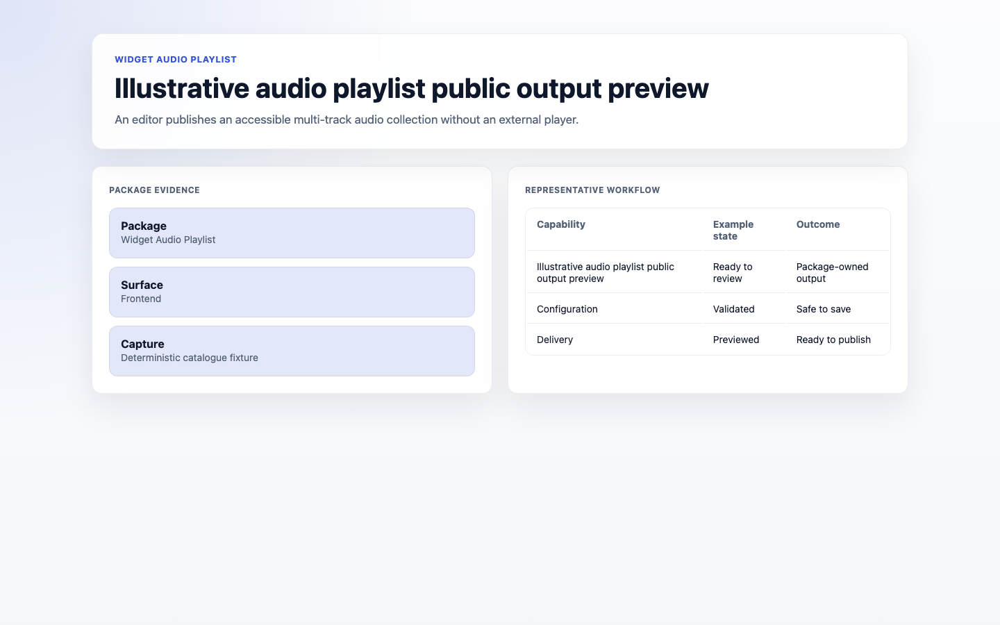
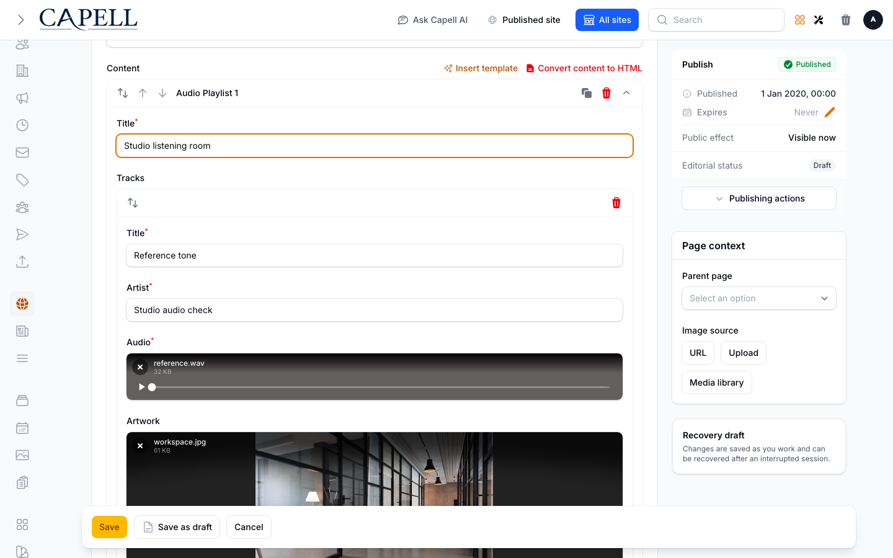

# Audio Playlist Widget

<!-- prettier-ignore-start -->

## What It Does

Audio Playlist adds a Layout Builder widget for local audio tracks with artwork, native controls, transcripts, and chapter markers. Its configuration accepts a bounded playlist and rejects remote audio sources.

- **Price and availability:** Check current availability and price on the [Capell Marketplace listing](https://capell.app/extensions/widget-audio-playlist).
- **Licence:** Check the licence terms on the [Capell Marketplace listing](https://capell.app/extensions/widget-audio-playlist).
- **Requires:** `PHP ^8.4`, `capell-app/admin ^1.0`, `capell-app/core ^1.0.66`, `capell-app/frontend ^1.0`, `capell-app/layout-builder ^1.0.44`, `spatie/laravel-package-tools ^1.0`.
- **Install:** `composer require capell-app/widget-audio-playlist`.

Editors configure the playlist in Layout Builder, and visitors receive a public player with track context and supporting transcript or chapter content when supplied.

## Who It Is For

**For developers:** The package registers a typed widget extension and validates media and nested track data before the public Blade render.

**For teams:** Teams can publish a structured listening experience with useful context instead of assembling separate players and transcript blocks.

## Quick Start

1. Install the package: `composer require capell-app/widget-audio-playlist`.
2. Open a page, click **Layout builder**, **Add widgets**, then choose **Audio Playlist**.

## Configure

This extension works without configuration. There is nothing to set after install.

## Limits And Pitfalls

- Install the required Capell packages at the versions in `composer.json`: `capell-app/admin ^1.0`, `capell-app/core ^1.0.66`, `capell-app/frontend ^1.0`, `capell-app/layout-builder ^1.0.44`.
- Keep public Blade and cached HTML free of authoring markers, model IDs, permissions, signed editor URLs, and lazy database queries.
- Custom write integrations must preserve invalidation for `widget-audio-playlist` cache tags.

## Screens And Workflow

- Audio Playlist Widget extension card (marketplace).
- Audio Playlist fields in Layout Builder (admin).
- Audio Playlist public output (frontend).
- Audio Playlist fields in Layout Builder with admin sidebar menu open (admin).

## Install Impact

- Required packages: `capell-app/admin`, `capell-app/core`, `capell-app/frontend`, `capell-app/layout-builder`.
- Admin navigation: no admin page or resource contribution is declared.
- Admin/editor extensions: `content-widget: WidgetAudioPlaylistContribution`.
- Permissions: no package permission declarations or Shield gates detected; host access rules still apply.
- Public routes: none declared.
- Database changes: no package migrations declared.
- Config: no package config files.
- Settings: no package settings declared.
- Queues or schedules: none declared.
- Cache tags: `widget-audio-playlist`.
- Commands: none declared.

## Troubleshooting

| Symptom | Likely cause | Check | Fix |
| --- | --- | --- | --- |
| Package surface is missing after install | Provider or manifest is not loaded | Confirm `capell.json`, package `composer.json`, and provider registration | Reinstall the package, refresh Composer autoload, and clear host caches |
| Public output leaks unexpected state | Render data, cache variation, or authoring boundary has regressed | Check public Blade, cache tags, and public-output safety tests | Move data loading out of Blade and rerun the package public-output tests |
| The playlist is refused | It has no tracks or more than 20 | Count the tracks in the widget | Keep between 1 and 20 tracks |
| A track is refused | The audio or artwork path is not a local media path, or a title or artist is over 120 characters | Check the track's audio and artwork fields | Pick files from the media library rather than pasting a web address, and shorten long titles |

## Upgrading

No manual steps between minor versions.

## Next Steps

- [Package docs](docs/README.md)
- [Overview](docs/overview.md)
- [Troubleshooting](#troubleshooting)
- [Developer reference](docs/reference.md)
- [Marketplace assets](docs/assets/marketplace/)
- [Capell content language plan](../../docs/CONTENT_LANGUAGE_PLAN.md)
- [Capell documentation design system](../../docs/DESIGN_SYSTEM.md)
- [Capell and package ERD notes](../../docs/erd/capell-and-package-erds.md)
- Related packages: [Layout Builder](../layout-builder/README.md).

<!-- prettier-ignore-end -->
